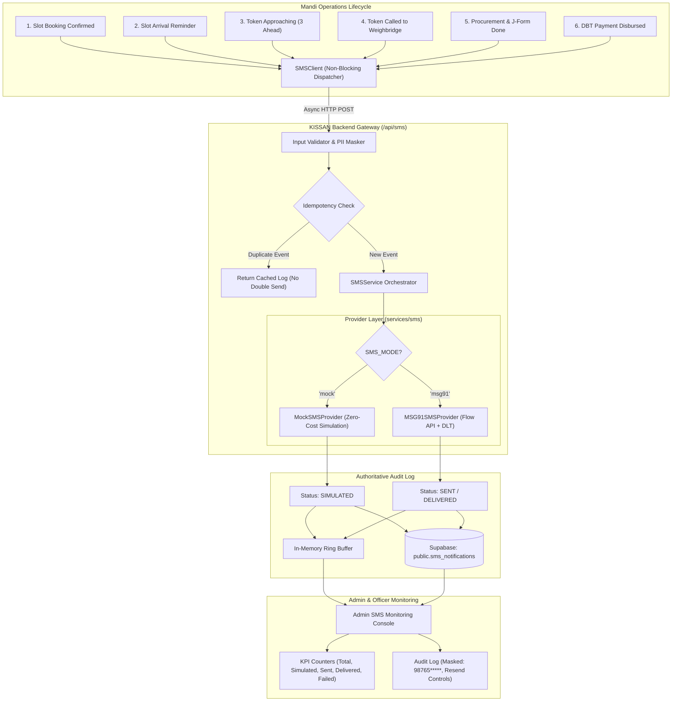

# KISSAN – Procure Smart Mandi: Production SMS Notification Architecture

> **Project**: KISSAN — Procure Smart Mandi  
> **Problem Statement ID**: 26032 (Department of Consumer Affairs - DoCA)  
> **Document**: SMS Gateway Architecture, DLT Integration & Operator Manual  
> **Status**: Production-Ready / Dual-Mode Active  

---

## 1. Executive Summary & Architectural Overview

Farmers face long waiting times, lack of information about procurement schedules, and uncertainty about procurement and payment status. While in-app alerts serve connected smartphone users, **SMS notifications are the authoritative, inclusive channel reaching every farmer across India**—even on basic feature phones without mobile internet.

The KISSAN SMS Notification Engine provides an **enterprise-grade, secure, non-blocking notification architecture** featuring:

1. **Dual-Mode Operation**:
   - `SMS_MODE = 'mock'` (**Default**): Zero-cost development and hackathon evaluation mode. Simulates telecom dispatch, generates realistic transmission delays, logs status as `SIMULATED`, and displays transparently in the Admin UI as *"SMS simulated — development mode"*. It **never** reports false telecom delivery.
   - `SMS_MODE = 'msg91'`: Production telecom mode integrating with the MSG91 Flow API, TRAI DLT Principal Entity headers, and delivery status webhooks.
2. **Zero Client-Side Secrets**:
   - Zero API keys, auth tokens, or private DLT IDs exist in frontend JavaScript. All communication is routed securely via server-side endpoints (`/api/sms/*`) and Supabase Edge Functions.
3. **Strict Idempotency**:
   - Automatically prevents duplicate SMS transmissions for the same event (`booking_id + notification_type`) using an atomic idempotency key guard (`IDEMP_{bookingId}_{notificationType}`).
4. **Resilient Non-Blocking Execution**:
   - SMS dispatch is strictly asynchronous. If an SMS provider fails, times out, or reports telecom errors, the core agricultural workflow (slot booking, queue advancement, weighment recording, and DBT payouts) will **never fail or rollback**.
5. **PII Privacy Protection**:
   - Recipient mobile numbers are masked (`98765*****`) across all dashboards, audit logs, and client responses to comply with Indian data privacy standards.

---

## 2. System Architecture Diagram



---

## 3. TRAI DLT Compliant Templates & Lifecycle Events

All SMS communications follow Telecom Regulatory Authority of India (TRAI) Distributed Ledger Technology (DLT) regulations:

| Event Identifier | Triggering Action | DLT Template ID | Template Message Structure |
| :--- | :--- | :--- | :--- |
| `BOOKING_CONFIRMED` | Farmer books slot in `js/booking.js` | `1107168000000001` | *Dear {farmer_name}, your procurement slot for {crop} ({quantity} Qtl) is CONFIRMED at {centre_name} on {slot_date} ({slot_time}). Your Token is {token_number}. Keep this gate pass handy upon arrival. — KISSAN Mandi Portal* |
| `SLOT_REMINDER` | 2h before slot / daily morning cron | `1107168000000002` | *Reminder: Dear {farmer_name}, your mandi arrival slot is scheduled for today at {slot_time} at {centre_name}. Token: {token_number}. Please arrive with your vehicle ({vehicle_number}) and clean produce. — KISSAN Mandi* |
| `TOKEN_APPROACHING` | Live queue has ≤ 3 vehicles ahead | `1107168000000003` | *Notice: Dear {farmer_name}, your Token {token_number} is approaching turn ({tokens_ahead} vehicles ahead) at {centre_name}. Please proceed towards Entry Gate / Inspection Bay. — KISSAN Mandi* |
| `TOKEN_CALLED` | Officer clicks "CALL NEXT" in `admin-queue.html` | `1107168000000004` | *URGENT: Dear {farmer_name}, Token {token_number} is CALLED NOW to Bay / Weighbridge at {centre_name}. Please move your vehicle immediately for electronic weighment and grading. — KISSAN Mandi* |
| `PROCUREMENT_COMPLETED`| Weighment slip submitted in `admin-procurement.html` | `1107168000000005` | *Weighment Receipt: Dear {farmer_name}, procurement of {quantity} Qtl {crop} has been COMPLETED at {centre_name}. Net Value: Rs {amount}. Official J-Form #{receipt_id} generated. Direct DBT payment initiated. — KISSAN Mandi* |
| `PAYMENT_STATUS_UPDATED`| Officer clicks "Mark as PAID" in `admin-procurement.html` | `1107168000000006` | *DBT Payment: Dear {farmer_name}, payment of Rs {amount} for J-Form #{receipt_id} has been PROCESSED. Transaction Ref: {transaction_id}. Disbursed via PFMS/Aadhaar Payment Bridge to your registered bank account. — KISSAN Mandi* |
| `TEST_MESSAGE` | Admin clicks "+ Send Test SMS" | `1107168000000007` | *KISSAN Mandi Gateway Test: Dear {farmer_name}, this is a test notification verifying communication for phone {phone_number}. Gateway Status: OK at {time}. — KISSAN Mandi* |

---

## 4. Database Schema (`public.sms_notifications`)

Run the database migration file [`supabase/sms_notifications.sql`](file:///c:/Users/Vivek%20Singh/Downloads/SIH32/SIH32/kissan-mandi/supabase/sms_notifications.sql) in your Supabase SQL Editor:

```sql
CREATE TABLE IF NOT EXISTS public.sms_notifications (
    id UUID PRIMARY KEY DEFAULT gen_random_uuid(),
    user_id UUID REFERENCES public.profiles(id) ON DELETE SET NULL,
    booking_id UUID REFERENCES public.bookings(id) ON DELETE SET NULL,
    phone_number TEXT NOT NULL,
    notification_type TEXT NOT NULL,
    template_id TEXT NOT NULL,
    provider TEXT NOT NULL DEFAULT 'mock',
    message TEXT NOT NULL,
    provider_message_id TEXT,
    status TEXT NOT NULL DEFAULT 'PENDING',
    error_message TEXT,
    attempt_count INT NOT NULL DEFAULT 0,
    idempotency_key TEXT UNIQUE,
    sent_at TIMESTAMPTZ,
    delivered_at TIMESTAMPTZ,
    created_at TIMESTAMPTZ NOT NULL DEFAULT NOW(),
    updated_at TIMESTAMPTZ NOT NULL DEFAULT NOW()
);

CREATE UNIQUE INDEX IF NOT EXISTS uq_sms_booking_event 
    ON public.sms_notifications(booking_id, notification_type) 
    WHERE booking_id IS NOT NULL AND status != 'FAILED';
```

### RLS Policies
- **Service Role**: Full read/write access.
- **Officers / Admins**: Read-only access to audit logs.
- **Farmers**: Read-only access scoped strictly to `auth.uid() = user_id`.

---

## 5. Environment Configuration (`.env`)

```ini
# Server Port
PORT=8080

# Gemini AI Engine
GEMINI_API_KEY=your_gemini_api_key

# SMS Mode: 'mock' (zero-cost hackathon simulation) or 'msg91' (production)
SMS_MODE=mock

# MSG91 Production Telecom Credentials (Required only when SMS_MODE=msg91)
# MSG91_AUTH_KEY=your_msg91_auth_key_here
# MSG91_SENDER_ID=KSMAND
# MSG91_DLT_ENTITY_ID=1101550000000000000
```

---

## 6. Backend API Reference

### 1. `POST /api/sms/send`
Dispatches an SMS notification through the active provider.
- **Request Body**:
  ```json
  {
    "notificationType": "BOOKING_CONFIRMED",
    "phoneNumber": "9876543210",
    "farmerName": "Rameshwar Singh",
    "bookingId": "BK-1024",
    "variables": {
      "crop": "Wheat",
      "quantity": 40,
      "centre_name": "Krishi Upaj Mandi, Karnal",
      "slot_date": "2026-09-20",
      "slot_time": "08:00 AM - 11:00 AM",
      "token_number": "KMN-042"
    }
  }
  ```
- **Response**:
  ```json
  {
    "success": true,
    "notification": {
      "id": "SMS-MU7JA3VZ-8907",
      "phone_number": "9876543210",
      "masked_phone": "98765*****",
      "notification_type": "BOOKING_CONFIRMED",
      "provider": "mock",
      "message": "Dear Rameshwar Singh, your procurement slot for Wheat (40 Qtl) is CONFIRMED at Krishi Upaj Mandi, Karnal on 2026-09-20 (08:00 AM - 11:00 AM). Your Token is KMN-042...",
      "status": "SIMULATED",
      "idempotency_key": "IDEMP_BK-1024_BOOKING_CONFIRMED",
      "sent_at": "2026-09-18T22:32:07.727Z"
    },
    "mode": "mock",
    "modeNotice": "SMS simulated — development mode"
  }
  ```

### 2. `GET /api/sms/logs`
Retrieves live audit logs and KPI metrics.
- **Query Parameters**: `limit` (default: 50), `status`, `type`.
- **Response**:
  ```json
  {
    "logs": [ ... ],
    "stats": {
      "total": 12,
      "simulated": 12,
      "sent": 0,
      "delivered": 0,
      "failed": 0,
      "pending": 0,
      "mode": "mock",
      "modeNotice": "SMS simulated — development mode (Zero-Cost Hackathon Mode)"
    }
  }
  ```

### 3. `GET /api/sms/status`
Returns active provider name, readiness, and DLT status.

### 4. `POST /api/sms/retry`
Bypasses idempotency and resends an existing notification by ID (`{ "smsId": "..." }`).

### 5. `POST /api/sms/mode`
Dynamically switches engine between `'mock'` and `'msg91'` (`{ "mode": "mock" }`).

### 6. `POST /api/sms/webhook`
Receives MSG91 telecom delivery status reports.

---

## 7. How to Demonstrate in Hackathon / Evaluator Presentation

1. **Open Admin Dashboard**:
   - Navigate to `http://localhost:8080/admin-dashboard.html`.
   - Scroll to **SMS Gateway & Live Delivery Console**.
   - Notice the prominent badge: **"Zero-Cost Simulator (Development Mode)"**.
   - Notice the KPI cards: Total Dispatched, Simulated (Dev), Sent/Delivered, Failed, Pending.
2. **Send a Test SMS**:
   - Click **"+ Send Test SMS"**.
   - Enter any 10-digit Indian number (e.g. `9876543210`), select an event (e.g. *Slot Booking Confirmed* or *DBT Payment Disbursed*), and click **"Dispatch Notification ->"**.
   - The table updates immediately with the masked recipient `98765*****` and status badge `● SIMULATED (DEV)`.
   - Click **"View"** to preview the exact SMS text formatted according to TRAI DLT templates.
3. **Verify Automatic Workflow Triggers**:
   - **Booking**: Go to `book-slot.html`, book a slot. Notice `BOOKING_CONFIRMED` SMS logged in console and admin table.
   - **Queue**: Go to `admin-queue.html`, click **"CALL NEXT"**. Notice `TOKEN_CALLED` SMS dispatched.
   - **Weighment**: Go to `admin-procurement.html`, submit a weighment record. Notice `PROCUREMENT_COMPLETED` SMS dispatched.
   - **Payment**: Click **"Mark as PAID"**. Notice `PAYMENT_STATUS_UPDATED` SMS dispatched with transaction reference.
4. **Run Verification Test Suite**:
   ```bash
   node test-sms-service.js
   ```
   All 51 automated unit and integration tests pass cleanly!
